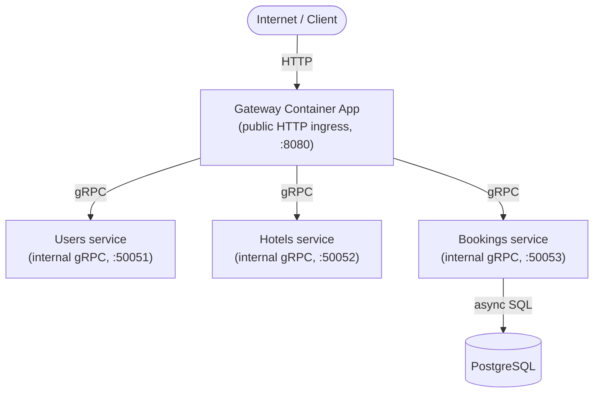
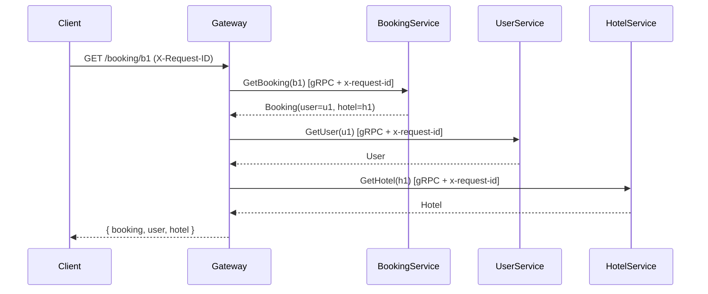

# Azure Container Apps Microservices Lab (.NET 10)

Невелика, наближена до продакшену мікросервісна аплікація на **C# / .NET 10**,
створена як навчальний майданчик для **Azure Container Apps**. Локально працює
повністю без Azure.

Тільки **Gateway** є публічним. Сервіси **Users**, **Hotels** і **Bookings**
спілкуються виключно по **gRPC (HTTP/2)** і не мають публічних HTTP-ендпоінтів.

---

## 1. Архітектура



Потік для `GET /booking/{id}`:



---

## 2. Локальні передумови

- [Docker Desktop](https://www.docker.com/products/docker-desktop/) з Docker Compose v2
- (Опційно, для запуску тестів / збірки поза Docker) [.NET 10 SDK](https://dotnet.microsoft.com/download)

Нічого з Azure для локального запуску не потрібно.

---

## 3. Запуск через Docker Compose

```powershell
docker compose up --build
```

Ця команда підіймає весь стек: `postgres`, `users`, `hotels`, `bookings`, `gateway`.

Gateway стає доступним на:

```
http://localhost:8080
```

Bookings автоматично створює таблицю `bookings` (якщо її немає) і засіває
детерміновані дані під час старту.

Зупинити й прибрати том БД:

```powershell
docker compose down -v
```

---

## 4. Як перевірити Gateway

Health-перевірка:

```powershell
curl http://localhost:8080/health
```

Отримати наявне (засіяне) бронювання з агрегацією user + hotel:

```powershell
curl http://localhost:8080/booking/b1
```

Приклад відповіді:

```json
{
  "booking": { "id": "b1", "userId": "u1", "hotelId": "h1",
               "checkIn": "2026-09-01", "checkOut": "2026-09-05", "status": "CONFIRMED" },
  "user":    { "id": "u1", "name": "Alice Johnson", "email": "alice@example.com" },
  "hotel":   { "id": "h1", "name": "Grand Riverside", "city": "Kyiv", "country": "Ukraine" }
}
```

Створити нове бронювання:

```powershell
curl -X POST http://localhost:8080/booking -H "Content-Type: application/json" -d '{ "userId": "u2", "hotelId": "h3", "checkIn": "2026-12-01", "checkOut": "2026-12-05" }'
```

Передати власний correlation-id (він повернеться у відповіді й проникне в усі логи):

```powershell
curl -H "X-Request-ID: my-trace-1" http://localhost:8080/booking/b1
```

---

## 5. Запуск тестів

```powershell
dotnet test tests/Tests.csproj
```

Тести покривають: поведінку gRPC-сервісів, `BookingService` (create/get на EF Core
InMemory), інтеграційну агрегацію `Gateway -> Booking -> User -> Hotel`, а також
health-ендпоінт і пропагацію `X-Request-ID`. PostgreSQL для тестів не потрібен.

---

## 6. gRPC-сервіси

Контракти визначені в [`proto/services.proto`](proto/services.proto):

| Сервіс           | RPC                                        |
|------------------|--------------------------------------------|
| `UserService`    | `GetUser(UserRequest) -> User`             |
| `HotelService`   | `GetHotel(HotelRequest) -> Hotel`          |
| `BookingService` | `GetBooking(BookingRequest) -> Booking`    |
| `BookingService` | `CreateBooking(CreateBookingRequest) -> Booking` |

Уся міжсервісна комунікація — типізовані protobuf-повідомлення (жодного JSON у gRPC).

---

## 7. Змінні середовища

**Gateway**

| Змінна                | За замовчуванням | Опис                          |
|-----------------------|------------------|-------------------------------|
| `GATEWAY_HTTP_PORT`   | `8080`           | Публічний HTTP-порт           |
| `USERS_GRPC_HOST`     | `users`          | Хост сервісу Users            |
| `USERS_GRPC_PORT`     | `50051`          | Порт сервісу Users            |
| `HOTELS_GRPC_HOST`    | `hotels`         | Хост сервісу Hotels           |
| `HOTELS_GRPC_PORT`    | `50052`          | Порт сервісу Hotels           |
| `BOOKINGS_GRPC_HOST`  | `bookings`       | Хост сервісу Bookings         |
| `BOOKINGS_GRPC_PORT`  | `50053`          | Порт сервісу Bookings         |

**Внутрішні сервіси**

| Змінна                | За замовчуванням | Сервіс   |
|-----------------------|------------------|----------|
| `USERS_GRPC_PORT`     | `50051`          | Users    |
| `HOTELS_GRPC_PORT`    | `50052`          | Hotels   |
| `BOOKINGS_GRPC_PORT`  | `50053`          | Bookings |

**PostgreSQL (тільки Bookings)**

| Змінна               | За замовчуванням |
|----------------------|------------------|
| `POSTGRES_HOST`      | `localhost`      |
| `POSTGRES_PORT`      | `5432`           |
| `POSTGRES_DB`        | `bookings`       |
| `POSTGRES_USER`      | `postgres`       |
| `POSTGRES_PASSWORD`  | `postgres`       |

**OpenTelemetry (усі сервіси)**

| Змінна                          | За замовчуванням | Опис                                       |
|---------------------------------|------------------|--------------------------------------------|
| `OTEL_ENABLED`                  | `false`          | `true`/`1` вмикає трейсинг                  |
| `OTEL_EXPORTER_OTLP_ENDPOINT`   | —                | Стандартний OTLP endpoint (не Azure-специфічний) |

Якщо `OTEL_ENABLED` вимкнено, застосунок працює як звичайно, без жодного оверхеду
експортера.

---

## 8. Публічні vs внутрішні сервіси

- **Gateway** — єдина публічна точка входу. Приймає HTTP і оркеструє виклики
  до внутрішніх сервісів по gRPC.
- **Users / Hotels / Bookings** — слухають лише HTTP/2 (gRPC). Вони не мають
  HTTP REST API назовні. У Docker Compose їхні порти прокинуті **тільки для
  локального дебагу**; в Azure вони будуть за internal ingress.
- Тільки **Bookings** володіє даними бронювань і єдиний має доступ до PostgreSQL.
  Gateway **ніколи** не звертається до БД напряму.

---

## 9. Відповідність Azure Container Apps

Ті самі образи мапляться на чотири окремі Container Apps в одному Container Apps
Environment:

| Локальний сервіс | Azure Container App | Ingress    |
|------------------|---------------------|------------|
| `gateway`        | `gateway`           | External   |
| `users`          | `users`             | Internal   |
| `hotels`         | `hotels`            | Internal   |
| `bookings`       | `bookings`          | Internal   |

Для переходу в Azure змінюються **лише змінні середовища**, не код:

- `USERS_GRPC_HOST`, `HOTELS_GRPC_HOST`, `BOOKINGS_GRPC_HOST` вказуються на
  внутрішні DNS-імена Container Apps (напр. `users.internal.<env>.<region>.azurecontainerapps.io`).
- `POSTGRES_*` вказуються на Azure Database for PostgreSQL.
- `OTEL_ENABLED=true` + `OTEL_EXPORTER_OTLP_ENDPOINT` підключають Azure Monitor /
  Application Insights через OTLP.

У коді немає Azure SDK, захардкоджених Azure-хостів чи Azure-специфічних
експортерів — усе через стандартні gRPC/HTTP і змінні середовища.

> Документація зі власне деплою в Azure навмисно поки відсутня — перша віха
> це повністю робочий локальний застосунок.

---

## Структура репозиторію

```
proto/services.proto      спільний protobuf-контракт
shared/Contracts          згенеровані gRPC client+server стаби
shared/Common             логування (JSON), correlation, OTel, gRPC-інтерсептори
users/                    Users gRPC-сервіс (ASP.NET Core + Kestrel)
hotels/                   Hotels gRPC-сервіс
bookings/                 Bookings gRPC-сервіс (EF Core + Npgsql)
gateway/                  Публічний HTTP Gateway (gRPC-клієнти + агрегація)
tests/                    xUnit тести
docker-compose.yml
```
